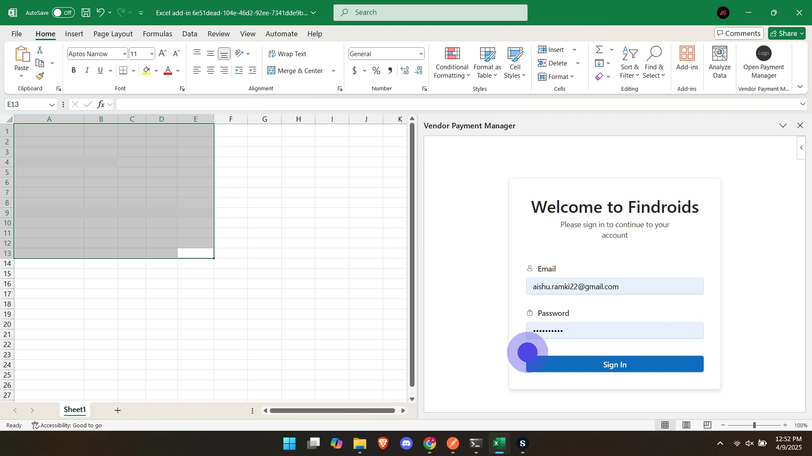
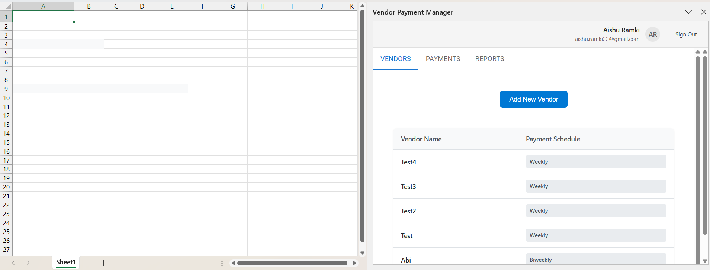
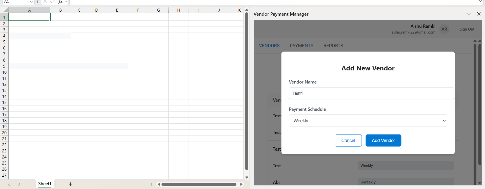
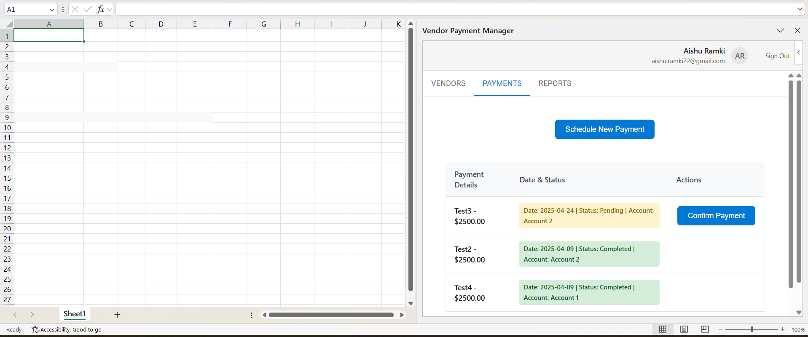
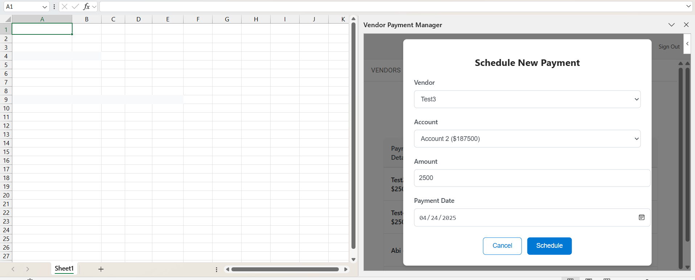
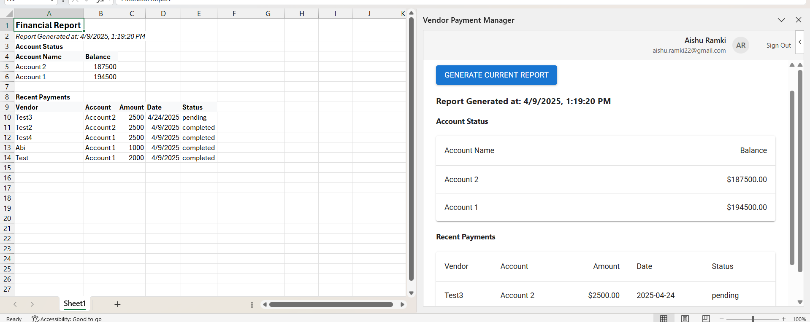

# Findroids Excel Add-In Documentation

## Project Overview
Findroids Excel Add-In is a powerful Microsoft Office Add-In that enhances Excel functionality by providing advanced data manipulation and analysis capabilities. The add-in is designed to help users efficiently work with financial data and perform complex operations within Excel.

## Technical Stack

### Core Technologies
- **TypeScript** - Primary programming language
- **React** - Frontend framework (v18.2.0)
- **Office.js** - Microsoft Office Add-in API
- **Webpack** - Module bundler and development server

### UI Frameworks and Libraries
- **Fluent UI React** (@fluentui/react-components v9.46.4) - Microsoft's design system
- **Material-UI** (@mui/material v5.15.10) - Additional UI components
- **Emotion** - CSS-in-JS styling solution
  - @emotion/react v11.11.3
  - @emotion/styled v11.11.0

### State Management
- **Zustand** (v5.0.3) - Lightweight state management solution

### Development Tools
- **Babel** - JavaScript/TypeScript compiler
  - @babel/core v7.24.0
  - @babel/preset-env v7.26.9
  - @babel/preset-typescript v7.23.3
- **ESLint** - Code linting with Office Add-ins specific rules
- **Prettier** - Code formatting
- **TypeScript** (v5.4.2) - Type checking and compilation

### Development Environment
- **webpack-dev-server** - Development server with hot reloading
- **Office Add-in DevTools**
  - office-addin-debugging
  - office-addin-dev-certs
  - office-addin-manifest
  - office-addin-lint

## Backend Documentation

### Backend Technical Stack

#### Core Technologies
- **Node.js** (v18.x) - Runtime environment
- **Express.js** (v4.18.x) - Web application framework
- **TypeScript** (v5.4.x) - Type-safe development

#### Database & Backend-as-a-Service
- **Supabase** - Open source Firebase alternative
  - PostgreSQL database with real-time capabilities
  - Built-in authentication and user management
  - Row Level Security (RLS) for data protection
  - Real-time subscriptions
  - Auto-generated APIs
  - Database backups and point-in-time recovery
  - Storage for files and media
  - Edge Functions for serverless computing

#### Authentication & Security
- **JSON Web Tokens (JWT)** - For secure authentication
- **bcrypt** - Password hashing
- **helmet** - HTTP security headers
- **cors** - Cross-Origin Resource Sharing

#### Testing & Quality Assurance
- **Jest** - Unit and integration testing
- **Supertest** - API endpoint testing
- **ESLint** - Code quality and style enforcement
- **Prettier** - Code formatting

#### Development Tools
- **nodemon** - Development server with hot reload
- **ts-node** - TypeScript execution environment
- **dotenv** - Environment variable management
- **winston** - Logging framework

#### API Documentation
- **Swagger/OpenAPI** - API documentation
- **JSDoc** - Code documentation

#### Deployment & DevOps
- **Docker** - Containerization
- **PM2** - Process management
- **GitHub Actions** - CI/CD pipeline
- **Azure App Service** - Cloud hosting platform

### System Requirements
- Node.js 18.x or higher
- Supabase PostgreSQL database
- NPM or Yarn package manager
- Docker (optional, for containerization)

### Development Setup
1. Install dependencies:
   ```bash
   npm install
   ```
2. Configure environment variables:
   ```bash
   cp .env.example .env
   ```
3. Start Supabase service
4. Run development server:
   ```bash
   npm run dev
   ```

### Build and Deployment
- Development build:
  ```bash
  npm run build:dev
  ```
- Production build:
  ```bash
  npm run build
  ```
- Docker build:
  ```bash
  docker build -t findroids-api .
  ```

## Project Structure
```
├── assets/             # Static assets
├── src/               # Source code
├── .vscode/           # VS Code configuration
├── manifest.xml       # Add-in manifest
├── webpack.config.js  # Webpack configuration
├── package.json       # Project dependencies
├── tsconfig.json     # TypeScript configuration
└── babel.config.json # Babel configuration
```

## Development Setup

### Prerequisites
- Node.js (Latest LTS version recommended)
- Microsoft Excel (Desktop or Online)
- Visual Studio Code (recommended)

### Installation
1. Clone the repository
2. Install dependencies:
   ```bash
   npm install
   ```
3. Start the development server:
   ```bash
   npm start
   ```

### Available Scripts
- `npm run build` - Production build
- `npm run build:dev` - Development build
- `npm start` - Start development server
- `npm run lint` - Run linting checks
- `npm run lint:fix` - Fix linting issues
- `npm run validate` - Validate the manifest file

## Browser Support
The add-in supports:
- Latest 2 versions of modern browsers
- Internet Explorer 11

## User Interface and Features

### 1. Authentication Screen


The initial screen users encounter is the authentication interface, which includes:

#### Components:
- **Welcome Header**: Displays "Welcome to Findroids"
- **Sign-in Form**:
  - Email input field
  - Password input field (secured)
  - Sign In button with modern design
- **User Experience**:
  - Clean, minimalist design
  - Responsive layout
  - Clear input validation
  - Professional color scheme matching Microsoft Office theme

#### Security Features:
- Secure password field with masked input
- Email validation
- Protected authentication flow

The login screen ensures secure access to the Findroids functionality while maintaining a professional and user-friendly interface consistent with Microsoft Office design principles.

### 2. Main Dashboard


The main dashboard provides a comprehensive interface for managing vendor payments with the following features:

#### Header Components:
- **User Profile Section**:
  - Displays user name and email
  - User initials avatar (AR)
  - Sign Out button
- **Navigation Tabs**:
  - VENDORS (default active tab)
  - PAYMENTS
  - REPORTS

### 3. Vendor Management
The Vendors tab provides a complete vendor management system:

#### Vendor List View:
- **Column Headers**:
  - Vendor Name
  - Payment Schedule
- **List Features**:
  - Sortable columns
  - Clear visibility of payment schedules
  - Easy-to-scan layout
- **Payment Schedule Options**:
  - Weekly
  - Biweekly
  - (Other customizable options)

#### Add New Vendor


The "Add New Vendor" functionality includes:

- **Action Button**: 
  - Prominent "Add New Vendor" button
  - Positioned for easy access

- **Modal Dialog**:
  - Clean, focused interface
  - Form Fields:
    - Vendor Name (text input)
    - Payment Schedule (dropdown)
      - Weekly
      - Biweekly
      - (Other options)
  - Action Buttons:
    - "Add Vendor" (primary action)
    - "Cancel" (secondary action)

#### User Experience Features:
- Responsive and fluid interface
- Clear visual hierarchy
- Consistent Microsoft Office design language
- Easy navigation between different sections
- Intuitive vendor management workflows

### 4. Payment Management


The Payments tab provides a comprehensive payment management system with the following features:

#### Payment List View:
- **Column Headers**:
  - Payment Details (Vendor name and amount)
  - Date & Status
  - Actions

- **Payment Information Display**:
  - Vendor name with payment amount (e.g., "Test3 - $2500.00")
  - Date, Status, and Account information
  - Color-coded status indicators:
    - Yellow background for Pending payments
    - Green background for Completed payments

#### Schedule New Payment


The "Schedule New Payment" functionality includes:

- **Action Button**:
  - Prominent "Schedule New Payment" button
  - Positioned at the top of the payments list

- **Modal Dialog**:
  - Form Fields:
    - Vendor (dropdown selection)
    - Account (dropdown with balance display)
    - Amount (numeric input)
    - Payment Date (date picker)
  - Action Buttons:
    - "Schedule" (primary action)
    - "Cancel" (secondary action)

#### Payment Actions
- **Confirm Payment**:
  - Available for pending payments
  - Clear action button for each pending payment
  - Updates payment status upon confirmation

#### Payment Status Features:
- **Status Types**:
  - Pending: Awaiting confirmation
  - Completed: Successfully processed
- **Status Information**:
  - Payment date
  - Current status
  - Associated account
- **Visual Indicators**:
  - Distinct styling for different payment states
  - Clear action buttons based on payment status

#### User Experience Features:
- Intuitive payment scheduling workflow
- Clear payment status visualization
- Easy-to-use date selection
- Account balance visibility
- Streamlined payment confirmation process
- Responsive and accessible interface

### 5. Financial Reports


The Reports tab provides comprehensive financial reporting capabilities with dual-view functionality (Task Pane and Excel Sheet).

#### Report Generation
- **Action Button**:
  - "GENERATE CURRENT REPORT" button
  - Generates real-time financial data
  - Timestamp indication of report generation

#### Report Components

##### Account Status Section:
- **Account Overview Table**:
  - Account Name column
  - Balance column with currency formatting
  - Clear presentation of multiple accounts
  - Current balance for each account
  
##### Recent Payments Section:
- **Detailed Payment History Table**:
  - Columns:
    - Vendor
    - Account
    - Amount
    - Date
    - Status
  - Comprehensive view of all transactions
  - Status indicators for payment states

#### Dual-View Functionality

##### Task Pane View:
- Clean, organized layout
- Real-time data display
- Easy-to-read formatting
- Scrollable interface for viewing all data

##### Excel Sheet Generation:
- **Automated Sheet Creation**:
  - Creates "Financial Report" worksheet
  - Formatted tables and headers
  - Professional spreadsheet layout
- **Data Organization**:
  - Account status section with balances
  - Recent payments table with complete transaction history
  - Timestamp of report generation
  - Consistent formatting with currency values

#### User Experience Features:
- One-click report generation
- Synchronized data between task pane and Excel
- Professional financial formatting
- Clear timestamp for report tracking
- Easy-to-read tabular format
- Instant access to financial overview
- Exportable Excel format for further analysis

